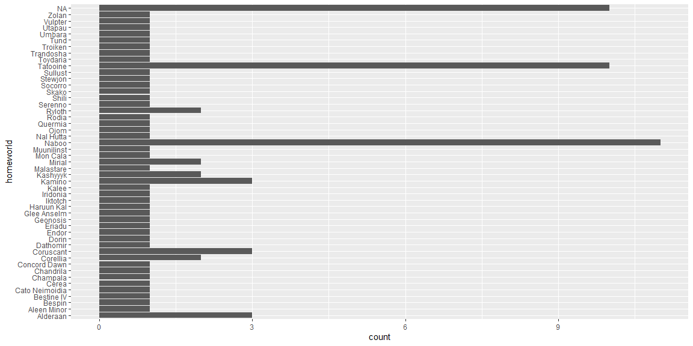

## Reading Notes
EDA - Exploratory Data Analysis
EDA is a cycle:
1. Generate questions about your data
2. Search for answers by visualising, transforming, and modelling your data
3. Use what you learn to refine your questions and/or generate new questions

In the first step, the world is your oyster per se. Play and search through the data to get to know the ins and outs of it.

When asking questions, don't search for the important one. Just ask as many questions as you can think of first and go delve into them. As you answer them, new questions will appear

1. What type of variation occurs within my variables?
2. What type of covariation occurs between my variables?

Tabular Data: A set of values associated with a variable and an observation. This is tidy when each value is placed in its own cell

Count values dplyr::count()

binwidth sets the size of each bin in a geom_histogram

ggplot2::cut_width() includes a way to calculate by hand

freqpoly is a histogram that displays lines instead of bars which is convenient when wanting to add a layer of comparison through throwing in a colour=(data$table)

Throw a coord_cartesian(ylim=c(0,50)) to set the y-min and max to focus in on outliers. (there is also a xlim)

Don't remove data until you are sure that the effect is none to what you are trying to do.

Practice with and without outliers.

Use filter to remove what is unwanted


Use mutate to replace a variable (row/column) with a modified copy. Use ifelse() to replace unusual values with NA

Ex: mutate(y = ifelse(y < 3 | y > 20, NA, y))
An alternative to ifelse() is case_when() in dplyr package

ggplot naturally removes this, so use na.rm = TRUE to fix this.
i.e. 
  ggplot(data = diamonds2,     mapping = aes(x = x, y = y)) + 
  geom_point(na.rm = TRUE)
  
You can use is.na() to to only focus on the values that are NA

Display density to better compare continuous data to catagorical and use a freqpoly

If you're trying compare between groups and don't care about distribution, a whisker pot would be better. (boxplot)

reorder through a median
ex: 
ggplot(data = mpg) +
  geom_boxplot(mapping = aes(x = reorder(class, hwy, FUN = median), y = hwy))
TO transpose, do +coord_flip() at the end of the boxplot

You can use a geom_count with a x= and y= to count the amount of data that falls in each group combination. (2 cat)

A cool way to compare two categorical is geom_tile

ex: 
diamonds %>% 
  count(color, cut) %>%  
  ggplot(mapping = aes(x = color, y = cut)) +
    geom_tile(mapping = aes(fill = n))

For 2 continuous, use a point plot. Throw in a alpha=1/100 to help see anything with large amounts of data

You can also do geom_bin2d or through the package hexbin, do geom_hex

You can also bin one of them

You can make models through library(modelr). 

You can convert a pipe into a graph without storing the pipe through throwing a + graph at the end.
Ex: 
diamonds %>% 
  count(cut, clarity) %>% 
  ggplot(aes(clarity, cut, fill = n)) + 
    geom_tile()

Go to https://r4ds.had.co.nz/exploratory-data-analysis.html for better understanding of these notes.

## EDA Example

The code below is an example of the EDA process using the `starwars` data from the `tidyverse` package. (Make sure you have the `tidyverse` package installed!)

Run the code line-by-line and look at the output. Add a comment to each line of code that explains what it does/what insights it provides.


```r
library(tidyverse)

dim(starwars)
```

```
## [1] 87 14
```

```r
colnames(starwars)
```

```
##  [1] "name"       "height"     "mass"       "hair_color" "skin_color"
##  [6] "eye_color"  "birth_year" "sex"        "gender"     "homeworld" 
## [11] "species"    "films"      "vehicles"   "starships"
```

```r
head(starwars)
```

```
## # A tibble: 6 x 14
##   name  height  mass hair_color skin_color eye_color birth_year sex   gender
##   <chr>  <int> <dbl> <chr>      <chr>      <chr>          <dbl> <chr> <chr> 
## 1 Luke~    172    77 blond      fair       blue            19   male  mascu~
## 2 C-3PO    167    75 <NA>       gold       yellow         112   none  mascu~
## 3 R2-D2     96    32 <NA>       white, bl~ red             33   none  mascu~
## 4 Dart~    202   136 none       white      yellow          41.9 male  mascu~
## 5 Leia~    150    49 brown      light      brown           19   fema~ femin~
## 6 Owen~    178   120 brown, gr~ light      blue            52   male  mascu~
## # ... with 5 more variables: homeworld <chr>, species <chr>, films <list>,
## #   vehicles <list>, starships <list>
```

```r
glimpse(starwars)
```

```
## Rows: 87
## Columns: 14
## $ name       <chr> "Luke Skywalker", "C-3PO", "R2-D2", "Darth Vader", "Leia...
## $ height     <int> 172, 167, 96, 202, 150, 178, 165, 97, 183, 182, 188, 180...
## $ mass       <dbl> 77.0, 75.0, 32.0, 136.0, 49.0, 120.0, 75.0, 32.0, 84.0, ...
## $ hair_color <chr> "blond", NA, NA, "none", "brown", "brown, grey", "brown"...
## $ skin_color <chr> "fair", "gold", "white, blue", "white", "light", "light"...
## $ eye_color  <chr> "blue", "yellow", "red", "yellow", "brown", "blue", "blu...
## $ birth_year <dbl> 19.0, 112.0, 33.0, 41.9, 19.0, 52.0, 47.0, NA, 24.0, 57....
## $ sex        <chr> "male", "none", "none", "male", "female", "male", "femal...
## $ gender     <chr> "masculine", "masculine", "masculine", "masculine", "fem...
## $ homeworld  <chr> "Tatooine", "Tatooine", "Naboo", "Tatooine", "Alderaan",...
## $ species    <chr> "Human", "Droid", "Droid", "Human", "Human", "Human", "H...
## $ films      <list> [<"The Empire Strikes Back", "Revenge of the Sith", "Re...
## $ vehicles   <list> [<"Snowspeeder", "Imperial Speeder Bike">, <>, <>, <>, ...
## $ starships  <list> [<"X-wing", "Imperial shuttle">, <>, <>, "TIE Advanced ...
```

```r
?starwars

starwars %>% count(species)
```

```
## # A tibble: 38 x 2
##    species       n
##  * <chr>     <int>
##  1 Aleena        1
##  2 Besalisk      1
##  3 Cerean        1
##  4 Chagrian      1
##  5 Clawdite      1
##  6 Droid         6
##  7 Dug           1
##  8 Ewok          1
##  9 Geonosian     1
## 10 Gungan        3
## # ... with 28 more rows
```

```r
mean(starwars$height)
```

```
## [1] NA
```

```r
mean(starwars$height, na.rm = TRUE)
```

```
## [1] 174.358
```

```r
summary(starwars$height)
```

```
##    Min. 1st Qu.  Median    Mean 3rd Qu.    Max.    NA's 
##    66.0   167.0   180.0   174.4   191.0   264.0       6
```

```r
cm_to_ft <- function(cm){
  ft = cm / 30.48
  return(ft)
}

starwars_2 <- starwars %>% mutate(height_ft = cm_to_ft(height)) 

dim(starwars_2)
```

```
## [1] 87 15
```

```r
colnames(starwars_2)
```

```
##  [1] "name"       "height"     "mass"       "hair_color" "skin_color"
##  [6] "eye_color"  "birth_year" "sex"        "gender"     "homeworld" 
## [11] "species"    "films"      "vehicles"   "starships"  "height_ft"
```

```r
summary(starwars_2$height_ft)
```

```
##    Min. 1st Qu.  Median    Mean 3rd Qu.    Max.    NA's 
##   2.165   5.479   5.906   5.720   6.266   8.661       6
```

```r
ggplot(starwars_2, aes(height_ft)) + 
  geom_histogram()
```

```
## Warning: Removed 6 rows containing non-finite values (stat_bin).
```

<!-- -->

```r
starwars_2 %>% filter(height_ft == max(height_ft))
```

```
## # A tibble: 0 x 15
## # ... with 15 variables: name <chr>, height <int>, mass <dbl>,
## #   hair_color <chr>, skin_color <chr>, eye_color <chr>, birth_year <dbl>,
## #   sex <chr>, gender <chr>, homeworld <chr>, species <chr>, films <list>,
## #   vehicles <list>, starships <list>, height_ft <dbl>
```

```r
starwars_2 %>% filter(height_ft == max(height_ft, na.rm = TRUE))
```

```
## # A tibble: 1 x 15
##   name  height  mass hair_color skin_color eye_color birth_year sex   gender
##   <chr>  <int> <dbl> <chr>      <chr>      <chr>          <dbl> <chr> <chr> 
## 1 Yara~    264    NA none       white      yellow            NA male  mascu~
## # ... with 6 more variables: homeworld <chr>, species <chr>, films <list>,
## #   vehicles <list>, starships <list>, height_ft <dbl>
```

```r
# https://starwars.fandom.com/wiki/Yarael_Poof
```

## EDA Practice

Continue exploring the `starwars` data to gain additional insights, using [R4DS: Chapter 7](https://r4ds.had.co.nz/exploratory-data-analysis.html) as a guide.

It is ok if you don't understand all the code in Chapter 7. (That is what we'll be learning the next two weeks!) If writing your own code is a struggle, try the "copy, paste, and tweak" method.


```r
# your code goes here
library(tidyverse)
library(ggplot2)
library(dplyr)
glimpse(starwars)
```

```
## Rows: 87
## Columns: 14
## $ name       <chr> "Luke Skywalker", "C-3PO", "R2-D2", "Darth Vader", "Leia...
## $ height     <int> 172, 167, 96, 202, 150, 178, 165, 97, 183, 182, 188, 180...
## $ mass       <dbl> 77.0, 75.0, 32.0, 136.0, 49.0, 120.0, 75.0, 32.0, 84.0, ...
## $ hair_color <chr> "blond", NA, NA, "none", "brown", "brown, grey", "brown"...
## $ skin_color <chr> "fair", "gold", "white, blue", "white", "light", "light"...
## $ eye_color  <chr> "blue", "yellow", "red", "yellow", "brown", "blue", "blu...
## $ birth_year <dbl> 19.0, 112.0, 33.0, 41.9, 19.0, 52.0, 47.0, NA, 24.0, 57....
## $ sex        <chr> "male", "none", "none", "male", "female", "male", "femal...
## $ gender     <chr> "masculine", "masculine", "masculine", "masculine", "fem...
## $ homeworld  <chr> "Tatooine", "Tatooine", "Naboo", "Tatooine", "Alderaan",...
## $ species    <chr> "Human", "Droid", "Droid", "Human", "Human", "Human", "H...
## $ films      <list> [<"The Empire Strikes Back", "Revenge of the Sith", "Re...
## $ vehicles   <list> [<"Snowspeeder", "Imperial Speeder Bike">, <>, <>, <>, ...
## $ starships  <list> [<"X-wing", "Imperial shuttle">, <>, <>, "TIE Advanced ...
```

```r
starwars %>% count(name, height)
```

```
## # A tibble: 87 x 3
##    name                height     n
##    <chr>                <int> <int>
##  1 Ackbar                 180     1
##  2 Adi Gallia             184     1
##  3 Anakin Skywalker       188     1
##  4 Arvel Crynyd            NA     1
##  5 Ayla Secura            178     1
##  6 Bail Prestor Organa    191     1
##  7 Barriss Offee          166     1
##  8 BB8                     NA     1
##  9 Ben Quadinaros         163     1
## 10 Beru Whitesun lars     165     1
## # ... with 77 more rows
```

```r
starwars %>% count(height, name)
```

```
## # A tibble: 87 x 3
##    height name                      n
##     <int> <chr>                 <int>
##  1     66 Yoda                      1
##  2     79 Ratts Tyerell             1
##  3     88 Wicket Systri Warrick     1
##  4     94 Dud Bolt                  1
##  5     96 R2-D2                     1
##  6     96 R4-P17                    1
##  7     97 R5-D4                     1
##  8    112 Sebulba                   1
##  9    122 Gasgano                   1
## 10    137 Watto                     1
## # ... with 77 more rows
```

```r
starwars %>% count(height)
```

```
## # A tibble: 46 x 2
##    height     n
##  *  <int> <int>
##  1     66     1
##  2     79     1
##  3     88     1
##  4     94     1
##  5     96     2
##  6     97     1
##  7    112     1
##  8    122     1
##  9    137     1
## 10    150     2
## # ... with 36 more rows
```

```r
ggplot(data=starwars) +
  geom_bar(mapping=aes(x=homeworld)) +
  coord_flip()
```

<!-- -->

```r
starwars %>% filter(starwars$name=="Ackbar") %>% count(height, name)
```

```
## # A tibble: 1 x 3
##   height name       n
##    <int> <chr>  <int>
## 1    180 Ackbar     1
```
