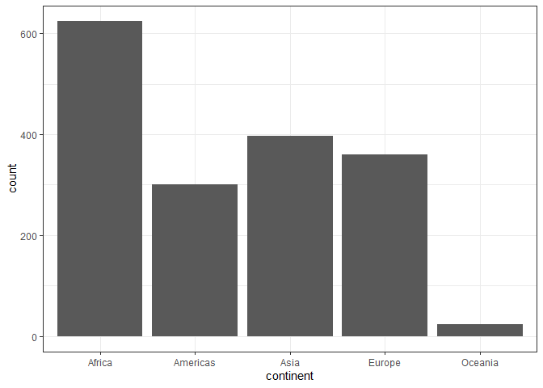
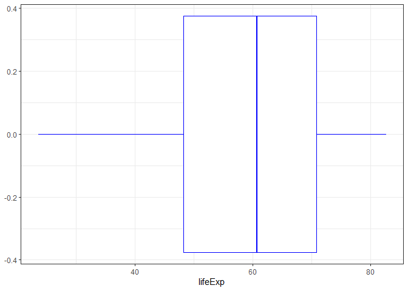
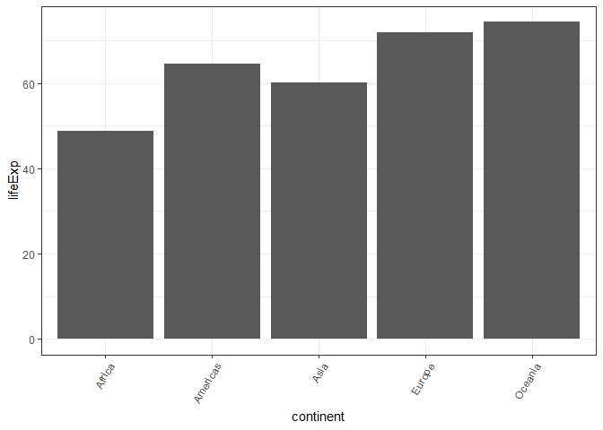

R Markdown
----------

    gapminder %>% 
      ggplot() +
      geom_bar(mapping=aes(x=continent)) +
      theme_bw()

    gapminder %>% 
      ggplot() +
      geom_boxplot(mapping=aes(x=lifeExp), color="blue") +
      theme_bw()

This chart shows the five-number summary of life expectancy overall. We
see that the median is a little past 60

    gapminder %>% glimpse()

    ## Rows: 1,704
    ## Columns: 6
    ## $ country   <fct> Afghanistan, Afghanistan, Afghanistan, Afghanistan, Afgha...
    ## $ continent <fct> Asia, Asia, Asia, Asia, Asia, Asia, Asia, Asia, Asia, Asi...
    ## $ year      <int> 1952, 1957, 1962, 1967, 1972, 1977, 1982, 1987, 1992, 199...
    ## $ lifeExp   <dbl> 28.801, 30.332, 31.997, 34.020, 36.088, 38.438, 39.854, 4...
    ## $ pop       <int> 8425333, 9240934, 10267083, 11537966, 13079460, 14880372,...
    ## $ gdpPercap <dbl> 779.4453, 820.8530, 853.1007, 836.1971, 739.9811, 786.113...

    gp <- aggregate(. ~ gapminder$continent, gapminder[4], mean)
    gp['continent']=gp$`gapminder$continent`
    gp %>% 
      ggplot() +
      geom_col(mapping=aes(x=continent, y=lifeExp)) +
      theme_bw() +
      theme (
        axis.text.x = element_text(angle=60, hjust=1)
      )

This shows the average life expectancy of each continent. Africa has the
lowest average life expectancy whereas Oceania has the highest average
life expectance

    gp <- gapminder %>% filter(!(country %in% 'Kuwait'))
    gp_save <- gp %>% 
      ggplot() +
      geom_bar(mapping=aes(x=continent)) +
      theme_bw() +
      scale_y_continuous(trans="sqrt")
    ggsave('graph.png', plot=gp_save, width=15)

    ## Saving 15 x 5 in image
