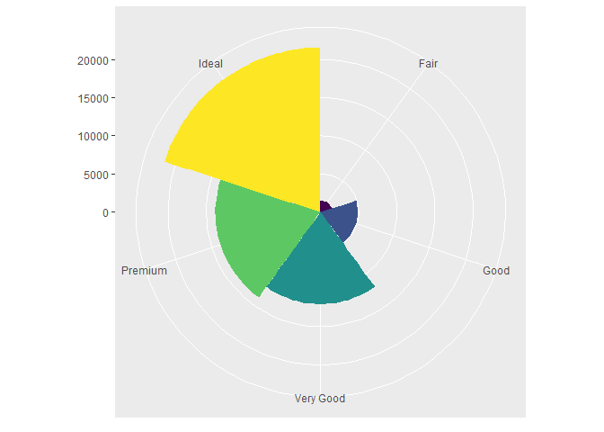

R Markdown
----------

    mpg %>% ggplot +
      geom_point(mapping=aes(x=displ, y=hwy))

This confirmed my hypothesis on fuel efficiency and engine size.

    ggplot(data=mpg)

    glimpse(mpg)

    ## Rows: 234
    ## Columns: 11
    ## $ manufacturer <chr> "audi", "audi", "audi", "audi", "audi", "audi", "audi"...
    ## $ model        <chr> "a4", "a4", "a4", "a4", "a4", "a4", "a4", "a4 quattro"...
    ## $ displ        <dbl> 1.8, 1.8, 2.0, 2.0, 2.8, 2.8, 3.1, 1.8, 1.8, 2.0, 2.0,...
    ## $ year         <int> 1999, 1999, 2008, 2008, 1999, 1999, 2008, 1999, 1999, ...
    ## $ cyl          <int> 4, 4, 4, 4, 6, 6, 6, 4, 4, 4, 4, 6, 6, 6, 6, 6, 6, 8, ...
    ## $ trans        <chr> "auto(l5)", "manual(m5)", "manual(m6)", "auto(av)", "a...
    ## $ drv          <chr> "f", "f", "f", "f", "f", "f", "f", "4", "4", "4", "4",...
    ## $ cty          <int> 18, 21, 20, 21, 16, 18, 18, 18, 16, 20, 19, 15, 17, 17...
    ## $ hwy          <int> 29, 29, 31, 30, 26, 26, 27, 26, 25, 28, 27, 25, 25, 25...
    ## $ fl           <chr> "p", "p", "p", "p", "p", "p", "p", "p", "p", "p", "p",...
    ## $ class        <chr> "compact", "compact", "compact", "compact", "compact",...

There are 234 rows and 11 columns

drv is the type of drive train, which describes front-wheel, rear wheel,
and 4 wheel drive.

    mpg %>% ggplot() +
      geom_point(mapping=aes(x=hwy, y=cyl))

    mpg %>% ggplot() +
      geom_point(mapping=aes(x=class,y=drv))

This isn’t very useful as a scatterplot due to the fact that this is two
categorical variables. A scatterplot is useful for finding trends with
at least one quantitative variable.

3.3
---

My explanation for the cars not following the linear trend in the graph
displ vs. hwy is that maybe this includes electric cars as well.

    distinct(mpg,class)

    ## # A tibble: 7 x 1
    ##   class     
    ##   <chr>     
    ## 1 compact   
    ## 2 midsize   
    ## 3 suv       
    ## 4 2seater   
    ## 5 minivan   
    ## 6 pickup    
    ## 7 subcompact

    ggplot(data = mpg) + 
      geom_point(mapping = aes(x = displ, y = hwy, color = class))

    ggplot(data = mpg) + 
      geom_point(mapping = aes(x = displ, y = hwy, size = class))

    ## Warning: Using size for a discrete variable is not advised.

    # Left
    ggplot(data = mpg) + 
      geom_point(mapping = aes(x = displ, y = hwy, alpha = class))

    ## Warning: Using alpha for a discrete variable is not advised.

    # Right
    ggplot(data = mpg) + 
      geom_point(mapping = aes(x = displ, y = hwy, shape = class))

    ## Warning: The shape palette can deal with a maximum of 6 discrete values because
    ## more than 6 becomes difficult to discriminate; you have 7. Consider
    ## specifying shapes manually if you must have them.

    ## Warning: Removed 62 rows containing missing values (geom_point).

    ggplot(data = mpg) + 
      geom_point(mapping = aes(x = displ, y = hwy), color = "blue")

    ggplot(data = mpg) + 
      geom_point(mapping = aes(x = displ, y = hwy, color = "blue"))

The paranthesis is setting color=‘blue’ to the aes function instead of
in the mapping.

hwy is continuous and displ is categorical.

Aes adjustments includes size, alpha, shape

Facets nicely splits the graphs

    ggplot(data = mpg) + 
      geom_point(mapping = aes(x = displ, y = hwy)) + 
      facet_wrap(~ class, nrow = 2)

    ggplot(data = mpg) + 
      geom_point(mapping = aes(x = displ, y = hwy)) + 
      facet_grid(drv ~ cyl)

    ggplot(data = mpg) + 
      geom_smooth(mapping = aes(x = displ, y = hwy, linetype = drv))

    ## `geom_smooth()` using method = 'loess' and formula 'y ~ x'

    ggplot(data = mpg) +
      geom_smooth(mapping = aes(x = displ, y = hwy))

    ## `geom_smooth()` using method = 'loess' and formula 'y ~ x'

    ggplot(data = mpg) +
      geom_smooth(mapping = aes(x = displ, y = hwy, group = drv))

    ## `geom_smooth()` using method = 'loess' and formula 'y ~ x'

    ggplot(data = mpg) +
      geom_smooth(
        mapping = aes(x = displ, y = hwy, color = drv),
        show.legend = FALSE
      )

    ## `geom_smooth()` using method = 'loess' and formula 'y ~ x'

    ggplot(data = mpg) + 
      geom_point(mapping = aes(x = displ, y = hwy)) +
      geom_smooth(mapping = aes(x = displ, y = hwy))

    ## `geom_smooth()` using method = 'loess' and formula 'y ~ x'

    ggplot(data = mpg, mapping = aes(x = displ, y = hwy)) + 
      geom_point(mapping = aes(color = class)) + 
      geom_smooth(data = filter(mpg, class == "subcompact"), se = FALSE)

    ## `geom_smooth()` using method = 'loess' and formula 'y ~ x'

    ggplot(data = diamonds) + 
      stat_summary(
        mapping = aes(x = cut, y = depth),
        fun.min = min,
        fun.max = max,
        fun = median
      )

    ggplot(data = diamonds) + 
      geom_bar(mapping = aes(x = cut, colour = cut))

    ggplot(data = diamonds) + 
      geom_bar(mapping = aes(x = cut, fill = cut))

    ggplot(data = diamonds) + 
      geom_bar(mapping = aes(x = cut, fill = clarity))

    ggplot(data = mpg, mapping = aes(x = class, y = hwy)) + 
      geom_boxplot()

    ggplot(data = mpg, mapping = aes(x = class, y = hwy)) + 
      geom_boxplot() +
      coord_flip()

    nz <- map_data("nz")

    ggplot(nz, aes(long, lat, group = group)) +
      geom_polygon(fill = "white", colour = "black")

    ggplot(nz, aes(long, lat, group = group)) +
      geom_polygon(fill = "white", colour = "black") +
      coord_quickmap()

    bar <- ggplot(data = diamonds) + 
      geom_bar(
        mapping = aes(x = cut, fill = cut), 
        show.legend = FALSE,
        width = 1
      ) + 
      theme(aspect.ratio = 1) +
      labs(x = NULL, y = NULL)

    bar + coord_flip()

    bar + coord_polar()

