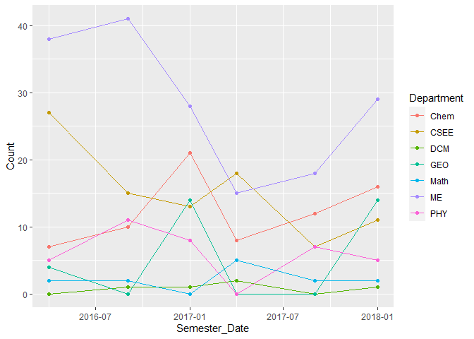
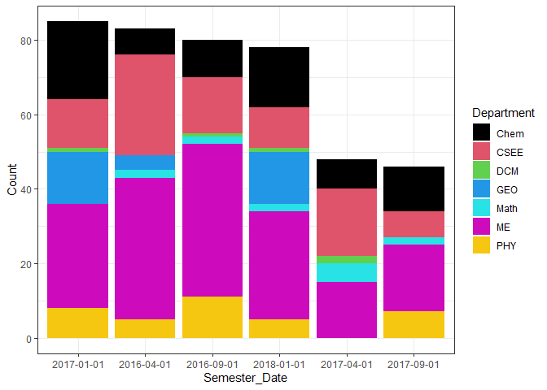
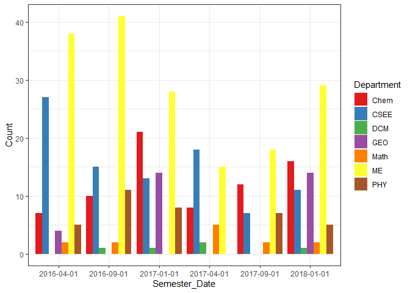
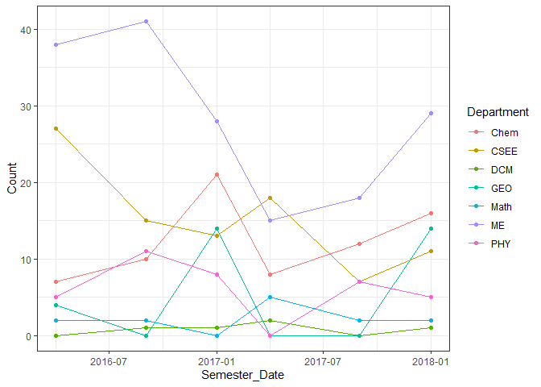
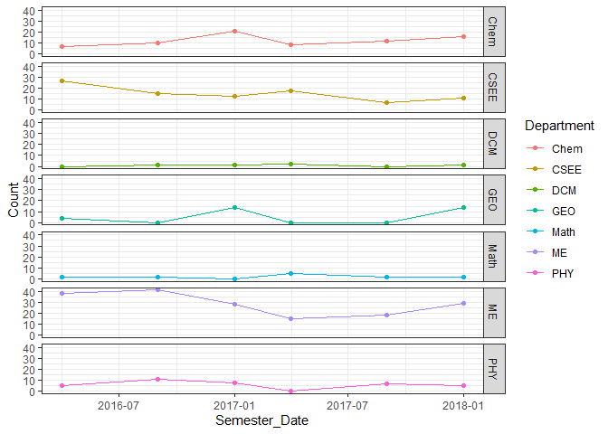

Task 6
------

    rcw <- read_csv("https://byuistats.github.io/M335/data/rcw.csv", 
                    col_types = cols(Semester_Date = col_date(format = "%m/%d/%y"), 
                                     Semester = col_factor(levels = c("Winter", "Spring", "Fall"))))

    rcw %>% glimpse()

    ## Rows: 42
    ## Columns: 5
    ## $ Year          <dbl> 2016, 2016, 2017, 2017, 2017, 2018, 2016, 2016, 2017,...
    ## $ Semester      <fct> Spring, Fall, Winter, Spring, Fall, Winter, Spring, F...
    ## $ Semester_Date <date> 2016-04-01, 2016-09-01, 2017-01-01, 2017-04-01, 2017...
    ## $ Count         <dbl> 7, 10, 21, 8, 12, 16, 27, 15, 13, 18, 7, 11, 0, 1, 1,...
    ## $ Department    <chr> "Chem", "Chem", "Chem", "Chem", "Chem", "Chem", "CSEE...

    ggplot(data = rcw, 
           mapping = aes(x = Semester_Date, 
                         y = Count, 
                         color = Department)) +
      geom_line() +
      geom_point()

    # reorder helped show the dates and the positioning of all the bars in the bar graph a lot better
    rercw <- reorder(rcw$Semester_Date, -rcw$Count)
    # The graph itself with a different color scheme
    rcw %>% 
      ggplot(order=Department) +
      geom_col(mapping=aes(x=rercw, y=Count, fill=Department)) +
      scale_fill_manual(values=palette('Set1')) +
      theme_bw() +
      labs(x="Semester_Date")

With this bar graph, it’s hard to keep track of anything other than
total attendance as you can’t really follow from semester to semester
focusing on a department. It does seem like attendance for ME decreased
halfway through and then started increasing again. For some reason,
2017-04-01 and 2017-09-01 has the smallest total attendance.

    # reorder helped show the dates and the positioning of all the bars in the bar graph a lot better
    rercw <- reorder(rcw$Semester_Date, rcw$Semester_Date)
    # The bar graph with a different color scheme as well as positioning of departments being side-by-side
    rcw %>% 
      ggplot(order=Department) +
      geom_col(mapping=aes(x=rercw, y=Count, fill=Department), position="dodge") +
      scale_fill_manual(values=palette('Set1')) +
      theme_bw() +
      labs(x="Semester_Date")

This graph is a lot easier to focus on a singular department as time
progresses. Everyone seems to have suffered some form of decline in
2017-04-01 and 2017-09-01 except for DCM experienced an increase in
attendance on 2017-04-01.

    # original graph with bw theme
    rcw %>% 
      ggplot(mapping = aes(x = Semester_Date, 
                         y = Count, 
                         color = Department)) +
      geom_line() +
      geom_point() +
      theme_bw()

This graph is hard to see anything except for a comparison of who has
the highest attendance at any given time which seems to be ME.

    # faceted the graphs
    rcw %>% 
      ggplot(mapping = aes(x = Semester_Date, 
                         y = Count, 
                         color = Department)) +
      geom_line() +
      geom_point() +
      theme_bw() +
      facet_grid(Department ~ .)

This graph lets us see each department separately to compare attendance
of each one over time. chem seems to be the only department that
attendance increases in-between every semester except for at one point
which has a dip.
