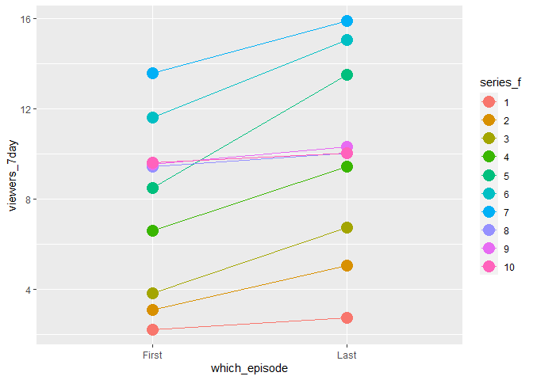
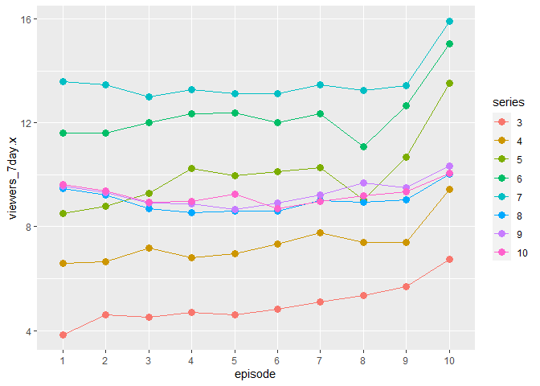

Notes: You can use filter to filter the rows. Like Where in SQL.
Comparitors are &lt;, &gt;, ==, and %in% And is & Or is | not is !

Use is.na(x) to test if a value is not present You can rename column
names with the rename function select is a query You can create new
columns through mutate and multiple at a time separated by a comma
logarithms are used through log(), log2(), log10() lead and lag can be
used to sselect a range specified ie 3:10 with an index from either
start or finish min\_rank() can be used for ranking values in order
summarise(mean = mean(dep\_delay, na.rm = TRUE))

R Markdown
----------

    only_first_last <- ratings %>% 
      group_by(series) %>% 
      slice(1,n()) %>% 
      mutate(which_episode = ifelse(episode==1, "First", "Last")) %>% 
      ungroup() %>% 
      mutate(series_f = as.factor(series))

    only_first_last %>% glimpse()

    ## Rows: 20
    ## Columns: 11
    ## $ series               <fct> 1, 1, 2, 2, 3, 3, 4, 4, 5, 5, 6, 6, 7, 7, 8, 8...
    ## $ episode              <fct> 1, 6, 1, 8, 1, 10, 1, 10, 1, 10, 1, 10, 1, 10,...
    ## $ uk_airdate           <date> 2010-08-17, 2010-09-21, 2011-08-16, 2011-10-0...
    ## $ viewers_7day         <dbl> 2.24, 2.75, 3.10, 5.06, 3.85, 6.74, 6.60, 9.45...
    ## $ viewers_28day        <dbl> 7.00, 1.00, 2.00, 1.00, 1.00, 1.00, 1.00, 1.00...
    ## $ network_rank         <int> NA, NA, NA, NA, NA, NA, 11, 4, 1, 1, 1, 1, 1, ...
    ## $ channels_rank        <int> NA, NA, NA, NA, NA, NA, NA, NA, NA, NA, 1, 1, ...
    ## $ bbc_iplayer_requests <dbl> NA, NA, NA, NA, NA, NA, NA, NA, NA, NA, 206300...
    ## $ episode_count        <dbl> 1, 6, 7, 14, 15, 24, 25, 34, 35, 44, 45, 54, 5...
    ## $ which_episode        <chr> "First", "Last", "First", "Last", "First", "La...
    ## $ series_f             <fct> 1, 1, 2, 2, 3, 3, 4, 4, 5, 5, 6, 6, 7, 7, 8, 8...

    only_first_last %>% 
      ggplot(mapping=aes(x=which_episode,
                         y=viewers_7day,
                         group=series_f,
                         color=series_f)) +
      geom_line() +
      geom_point(size=5)

    d<-ratings %>% 
      group_by(series) %>% 
      slice_tail(n=1) %>% 
      filter(episode %in% 10)
    epi_10_season <- ratings %>% 
      group_by(series) %>% 
      filter(series %in% d$series)

    mean_epi<-aggregate(. ~ epi_10_season$episode, epi_10_season[4], mean) %>% 
      rename(
        episode=`epi_10_season$episode`
      )
    epi_10_season <- epi_10_season %>% inner_join(mean_epi, by="episode")
    epi_10_season %>% 
      ggplot() +
      geom_line(mapping=aes(x=episode, y=viewers_7day.x, group=series, color=series)) +
      geom_point(mapping=aes(x=episode, y=viewers_7day.x, group=series, color=series), size=3)

    par(mfrow=c(2,1))
    epi_10_season %>% 
      ggplot() +
      geom_line(mapping=aes(x=episode, y=viewers_7day.x, group=series, color=series)) +
      geom_point(mapping=aes(x=episode, y=viewers_7day.x, group=series, color=series), size=3)

    epi_10_season %>% 
      ggplot() +
      geom_col(mapping=aes(x=episode, y=epi_10_season$viewers_7day.y))

